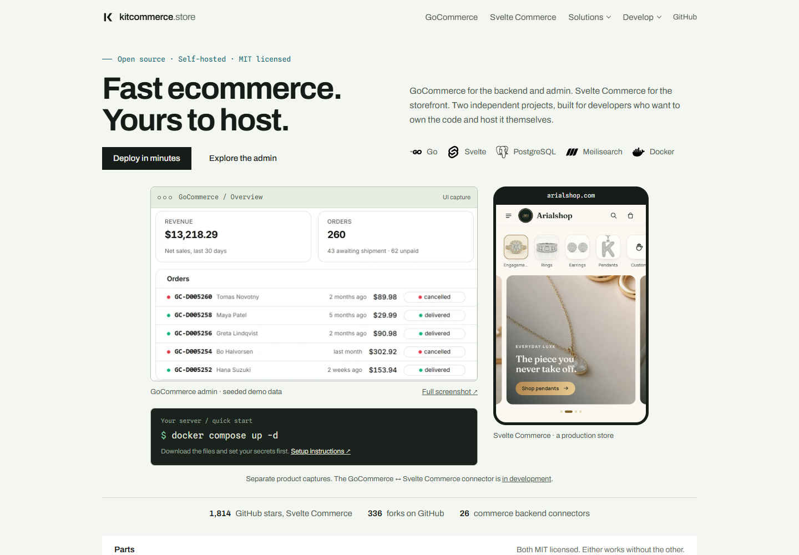
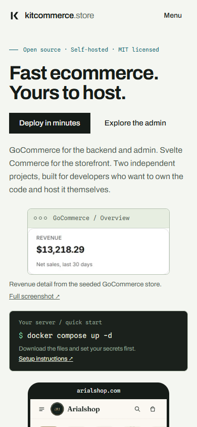
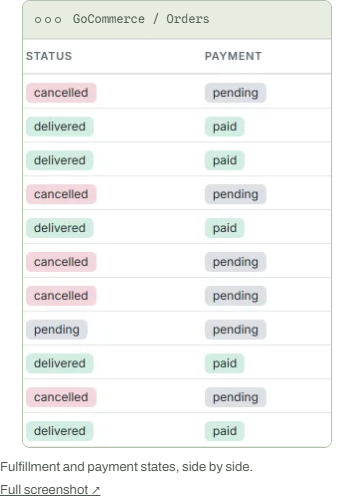
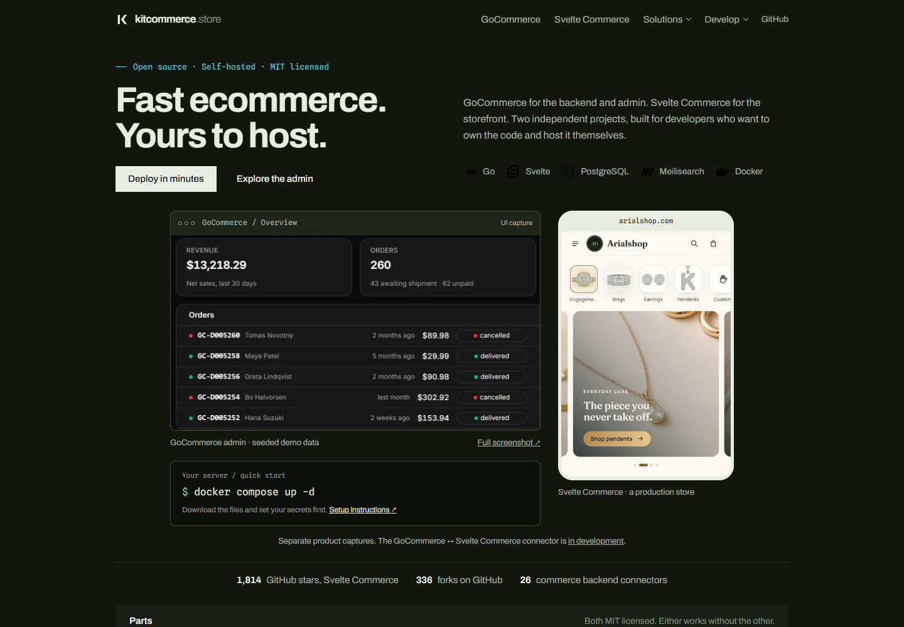

# Homepage visual refinement — verification

Verified on 21 September 2026 against the production build, served locally with
`npm run preview -- --host 127.0.0.1 --port 4173` in Chromium on Windows.

## Result

The original 1440px-wide page measured 13,783px tall; this revision measures
10,909px with the default admin tab and collapsed FAQs, about **21% shorter**.
The first view now shows real product UI and a selectable Docker command.
Typography, colors, navigation and the project chooser follow the existing site.

| Check | Result |
| --- | --- |
| Production build | Passed: eight static pages |
| Repository verification | Passed: naming, canonicals, sitemap, internal links, root files |
| Viewports | 320, 390, 768, 900, 901, 1280 and 1440px |
| Color schemes | Light and dark at every width |
| Admin gallery | All four tabs load the correct crop in all 14 viewport/theme combinations |
| Image geometry | No stretched aspect ratios or upscaled admin crops |
| Page fit | No horizontal overflow at the seven tested widths |
| Keyboard | ArrowRight, Home and End select and focus the correct tab |
| Full screenshot | Opens the original 1440px admin capture in a new tab |
| Copy | Clipboard matches setup text after Windows CRLF normalization |
| Mobile navigation | Opens and closes; expanded-state attributes update |
| FAQ | Answer expands and collapses on desktop and mobile |
| JavaScript disabled | Heading and default screenshot remain available |
| Motion | Normal scroll appearance and reduced-motion rendering inspected |
| Browser errors | No page JavaScript exceptions during the checks |
| Whitespace | `git diff --check` passed |

Visual review covered the opening views, admin crops, both SVG diagrams,
compact solution cards, Arialshop storefront, supporting developer sections,
FAQ and footer. Crops end at complete rows; mobile details have their own
captions. The storefront captures retain their original in-product carousel
edges. No blur, image filters or generated interface content were added.

This validates the marketing site, not a running commerce backend, checkout or
production deployment. The source UI captures were already in the repository.
The GoCommerce connector remains explicitly marked as unpublished. Browser
testing was in Chromium; Safari and Firefox were not exercised.

## Preview images

### Desktop, 1440 × 1000

### Mobile, 390 × 844

### Mobile order details

### Dark mode

Crop provenance and regeneration instructions are in the
[screenshot visual playbook](screenshot-visual-playbook.md).
